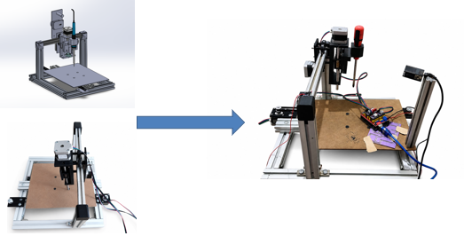
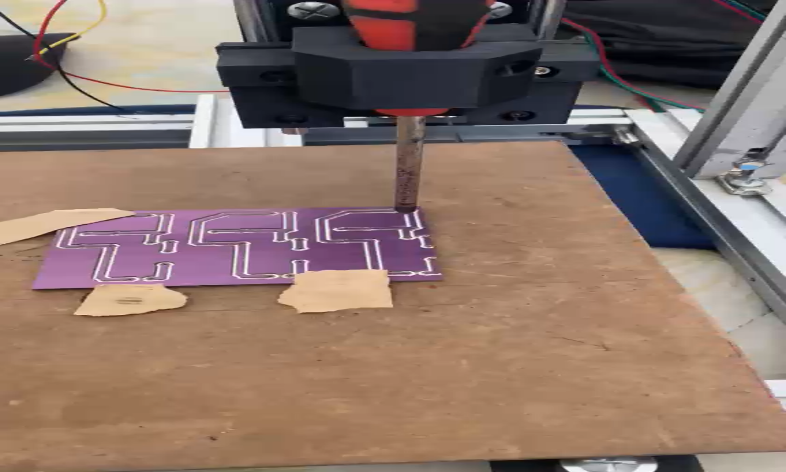
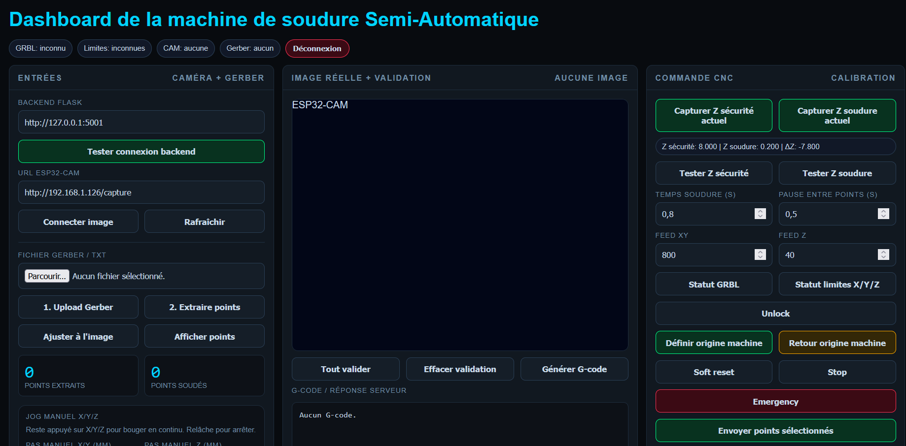

# Assistance Soudure PCB

Projet de Fin d'Études (PFE) réalisé par **Gatgout Kouni** et **Wedad Louleid**.

## Présentation

Ce projet consiste en la conception et la réalisation d'une **machine de soudure semi-automatique pour cartes de circuits imprimés (PCB)**. L'objectif est d'automatiser le déplacement du fer à souder selon une séquence programmée (axes X/Y/Z de type CNC), afin de fiabiliser et d'accélérer les opérations de soudage par rapport à une soudure manuelle.

Le projet couvre à la fois :
- la **conception mécanique** de la machine (structure, axes de déplacement, supports, fixations) ;
- le **pilotage logiciel** de la séquence de soudure.

## Contenu du dépôt

- `app_cnc_final_sequence_complete_robuste.py` — script principal de pilotage de la séquence CNC (gestion des déplacements des axes et de la séquence de soudure).
- `app_machine_soudure_semi_automatique.py.py` — application de contrôle de la machine de soudure semi-automatique.
- `PFE kouni/` — conception mécanique (SolidWorks) de la machine : pièces (`.SLDPRT`), assemblages (`.SLDASM`), plans de découpe laser (`.DXF`), modèles d'impression 3D (`.STL`) et composants standards (moteur pas-à-pas Nema 17, etc.).
- `dashboard/dashboard_machine_soudure.html` — tableau de bord web de pilotage de la machine (connexion au backend Flask, flux caméra ESP32-CAM, import de fichiers Gerber, calibration PCB, jog manuel des axes, envoi du G-code au GRBL).

### Sous-dossiers de conception

- `axe Z/` — assemblage et pièces de l'axe Z (déplacement vertical du fer à souder).
- `decoupe laser/` — fichiers DXF pour la découpe laser des plaques de structure.
- `fer/` — pièces liées au support et à la fixation du fer à souder.
- `impression/` — fichiers STL destinés à l'impression 3D des pièces support.
- `Nema 17 42x40x5/` — modèle et documentation du moteur pas-à-pas utilisé pour la motorisation des axes.

## Démonstration vidéo

<video src="videos/demo_gravure_pcb.mp4" controls width="600"></video>

Si la vidéo ne s'affiche pas directement, tu peux la télécharger ou la visionner ici : [videos/demo_gravure_pcb.mp4](videos/demo_gravure_pcb.mp4)

## Aperçu du projet

**De la conception (SolidWorks) à la machine réelle :**

**Gravure de la carte PCB par la machine CNC :**

**Tableau de bord de contrôle de la machine :**

## Auteurs

- **Gatgout Kouni**
- **Wedad Louleid**
